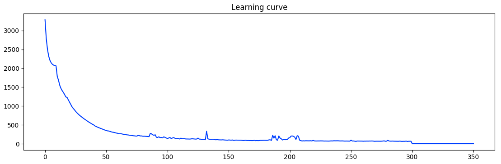

# Noise-Removal-with-Autoencoder
Random noise exists in wearable sensor based measurements whose frequency spreads from -&pi; to &pi;. Frequency filtering or smoothing is very likely damage critical information such as QRS. Remove noise from heartbeat using an trained autoencoder could be a good solution. The autoencoder is trained using noisy heartbeat as input and corresponding ground truth heartbeat as output. Noise is modeled as uniform distribution. Signal used in the example is sampled at 360 Hz.
 



Noise amplitude has been scaled such that the energy of noise is 70% of signal. 
### Dependency
- Numpy
- Tensorflow
- Matplotlib

### run example
```
~$ git clone
~$ cd /your folder
~$ python3 
```
### More
Under noise condition, detecting heartbeat location becomes more difficult. Combine signal processing with autoencoder will produce more robust result.
- [x] Autoencoder.
- [ ] Robust detection of R peak under strong noise condition.
- [ ] Estimating the level of noise.

